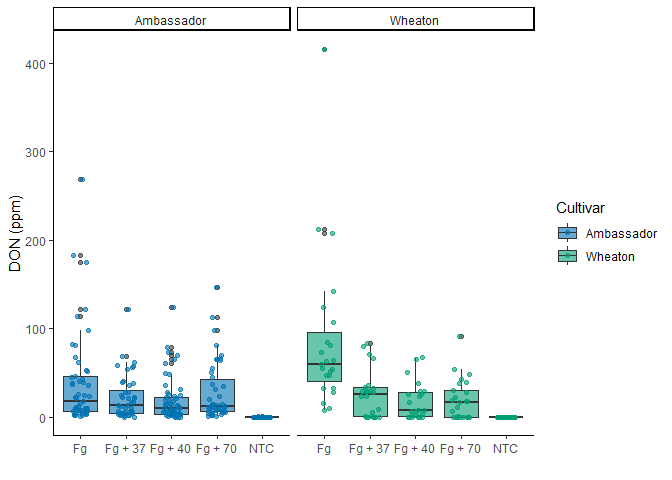
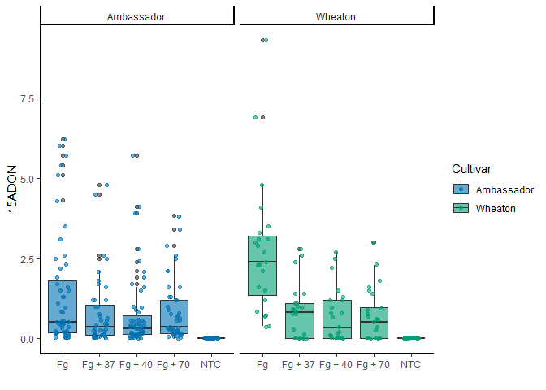
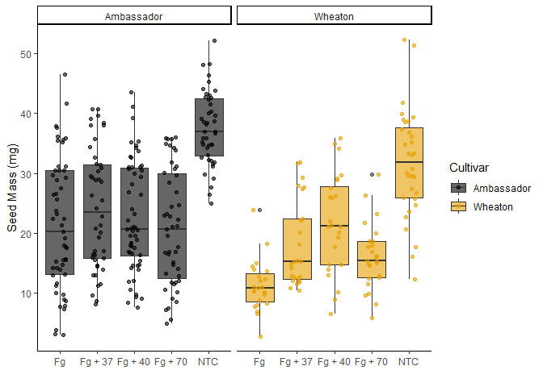
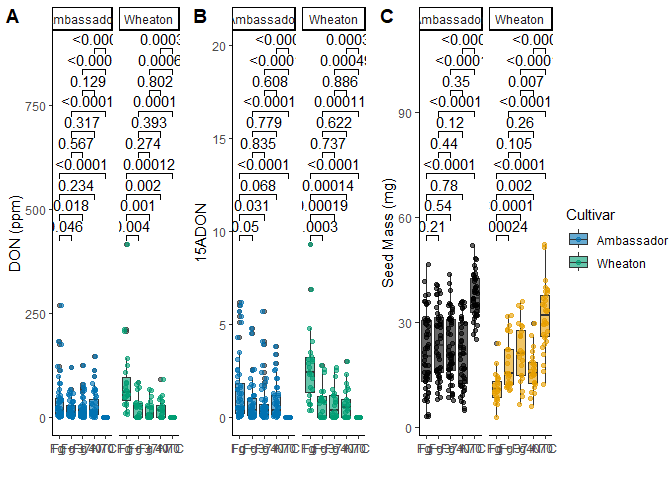

**Figures generated below are published
[here](https://doi.org/10.1094/PDIS-06-21-1253-RE)**

**Project Github repository**: Click
[Here](https://github.com/SamitKafle/codingchallenge4.git)

# Definition

1.  **YAML Header:** It is the structural block that defines metadata
    such as title, authors, date, outputformat and other document
    settings.

2.  **Literate Programming:** It is the method that combines a
    programming language with a documentation language that makes it
    easy to understand what is being executed.

# Knitr Options

    # turn off the warning display
    knitr::opts_chunk$set(warning = FALSE, message = FALSE)

# Read the data

    library(tinytex)
    library(ggplot2)
    library(ggpubr)
    datum=read.csv("MycotoxinData.csv",na.strings="na")
    datum$Treatment=as.factor(datum$Treatment)

# Define color palette

    #colorblind palette
    cbbPalette <- c("#000000", "#E69F00", "#56B4E9", "#009E73", 
                    "#F0E442", "#0072B2", "#D55E00", "#CC79A7")

# Figures

## Box plot of DON

    plot_DON<-ggplot(datum, aes(x = Treatment, y = DON, fill = Cultivar)) +
      geom_boxplot(alpha=0.6) + 
      geom_jitter(aes(color = Cultivar), width = 0.2, alpha = 0.6) + #b transparency of jitter point
      scale_fill_manual(values = c(cbbPalette[[6]], cbbPalette[[4]])) +
      scale_color_manual(values = c(cbbPalette[[6]], cbbPalette[[4]])) +
      labs(y = "DON (ppm)", x = "") +#c
      theme_classic() +#d
      facet_wrap(~Cultivar)#e

    plot_DON

## Box plot of 15 ADON

    plot_15ADON <- ggplot(datum, aes(x = Treatment, y = X15ADON, fill = Cultivar)) +
      geom_boxplot(alpha = 0.6) +
      geom_jitter(aes(color = Cultivar), width = 0.2, alpha = 0.6) +
      scale_fill_manual(values = c(cbbPalette[[6]], cbbPalette[[4]])) +
      scale_color_manual(values = c(cbbPalette[[6]], cbbPalette[[4]])) +
      labs(y = "15ADON", x = "") +
      theme_classic() +
      facet_wrap(~Cultivar)

    plot_15ADON

## Box plot of SeedMass

    plot_SeedMass <- ggplot(datum, aes(x = Treatment, y = MassperSeed_mg, fill = Cultivar)) +
      geom_boxplot(alpha = 0.6) +
      geom_jitter(aes(color = Cultivar), width = 0.2, alpha = 0.6) +
      scale_fill_manual(values = cbbPalette) +
      scale_color_manual(values = cbbPalette) +
      labs(y = "Seed Mass (mg)", x = "") +
      theme_classic() +
      facet_wrap(~Cultivar)

    plot_SeedMass

## Combined Plot with t test metrics

    plot_DON_ttest <- plot_DON + geom_pwc(aes(group=Treatment),method = "t.test")
    plot_15ADON_ttest <- plot_15ADON + geom_pwc(aes(group=Treatment),method = "t.test")
    plot_SeedMass_ttest <- plot_SeedMass + geom_pwc(aes(group=Treatment),method = "t.test")
    combined_plot_ttest <- ggarrange(plot_DON_ttest, plot_15ADON_ttest, plot_SeedMass_ttest, 
                                     labels = c("A", "B", "C"),
                                     ncol = 3, nrow = 1, common.legend = TRUE, legend = "right")

    combined_plot_ttest

